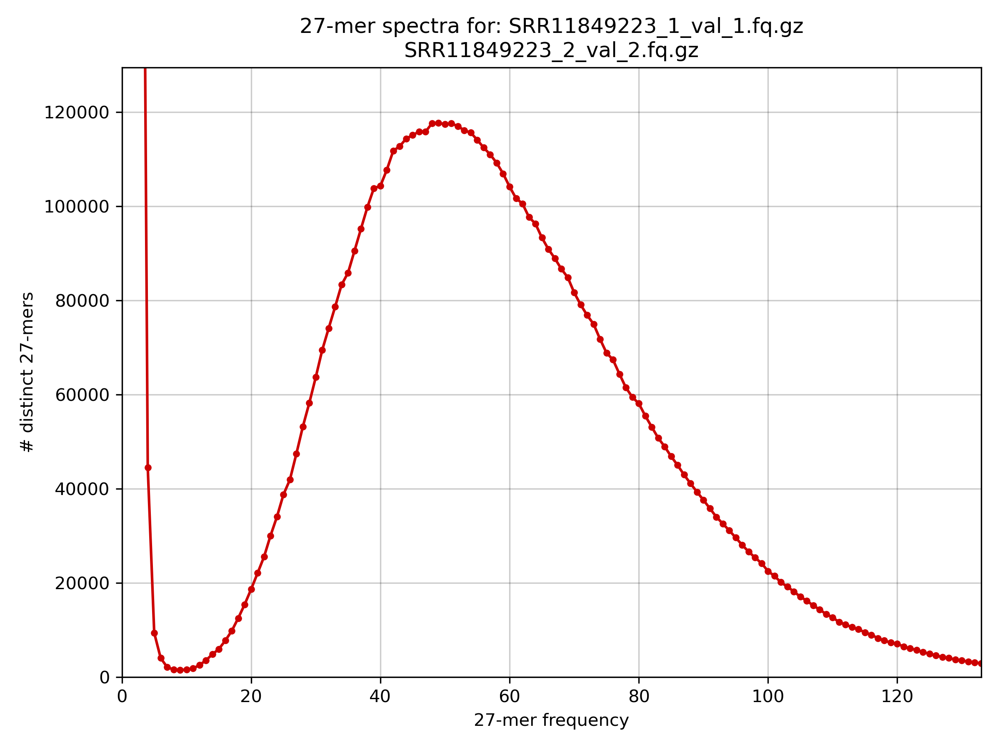
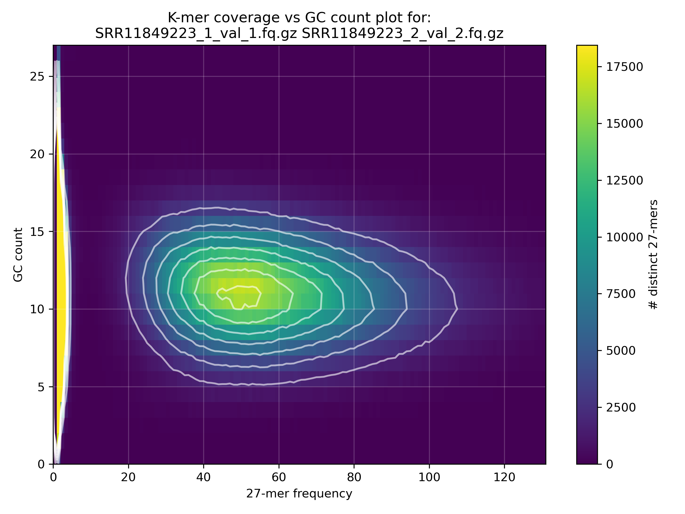
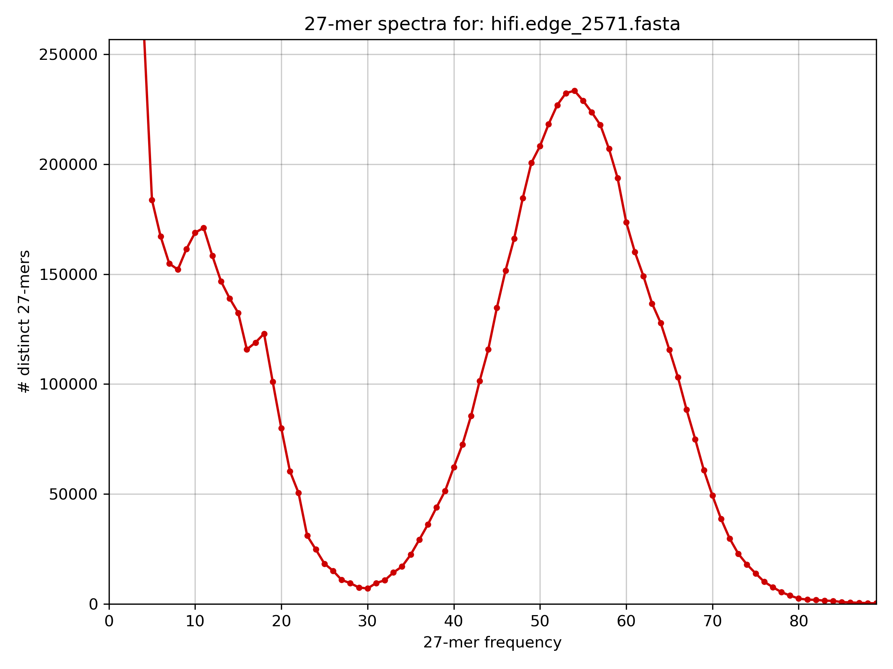
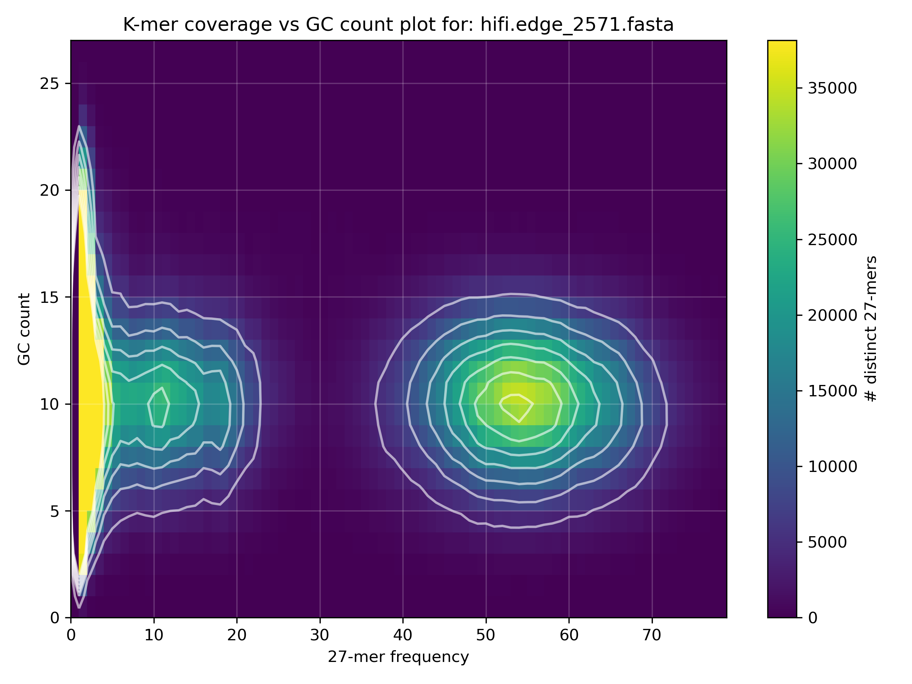
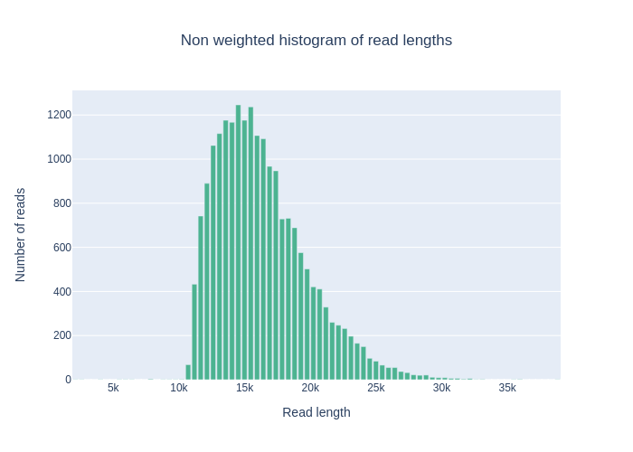

# Genome assembly

## Short-read assembly

You can find the short-read dataset in [European Nucleotide Archive](https://www.ebi.ac.uk/ena/browser/home) with the SRA number SRR11849223.

### Quality control and adapter trimming 

[FastQC](https://github.com/s-andrews/FastQC)
```sh
conda create -n fastqc_env 
conda activate fastqc_env
conda install -c bioconda fastqc
```
```sh
mkdir fastqc_raw
fastqc -o fastqc_raw SRR11849223_1.fastq.gz SRR11849223_2.fastq.gz
```

[TrimGalore](https://github.com/FelixKrueger/TrimGalore)
```sh
conda create -n trimgalore_env
conda activate trimgalore_env
conda install -c bioconda trim-galore
```
```sh
trim_galore --paired --fastqc --gzip -j 8 SRR11849223_1.fastq.gz SRR11849223_2.fastq.gz
```

### *k*-mer analyses

[KAT](https://github.com/TGAC/KAT)
```sh
conda create -n kat_env
conda activate kat_env 
conda install -c bioconda kat
```
```sh
kat hist -t 8 -o kat_hist_SRR11849223 SRR11849223_1_val_1.fq.gz SRR11849223_2_val_2.fq.gz
kat gcp -t 8 -o kat_gcp_SRR11849223 SRR11849223_1_val_1.fq.gz SRR11849223_2_val_2.fq.gz
```

 

### Genome assembly

[idba](https://github.com/loneknightpy/idba)
```sh
conda create -n idba_env
conda activate idba_env
conda install -c bioconda idba
```
```sh
gunzip -k SRR11849223_1_val_1.fq.gz
gunzip -k SRR11849223_2_val_2.fq.gz

fq2fa --merge SRR11849223_1_val_1.fq SRR11849223_2_val_2.fq SRR11849223.fasta

idba -l SRR11849223.fasta -o idba_SRR11849223 --num_threads 8
```

### Assembly statistics

[assembly-stats](https://github.com/sanger-pathogens/assembly-stats)
```sh
conda install -c bioconda assembly-stats
```
```sh
assembly-stats idba_SRR11849223/scaffold.fa
```
```sh
tats for idba_SRR11849223/scaffold.fa
sum = 6411223, n = 587, ave = 10922.02, largest = 475409
N50 = 130774, n = 16
N60 = 94063, n = 22
N70 = 73578, n = 30
N80 = 54738, n = 40
N90 = 25812, n = 57
N100 = 50, n = 587
N_count = 0
Gaps = 0
```

## Long-read assembly

### Preliminary analyses 

*k*-mer analyses: [KAT](https://github.com/TGAC/KAT)
```sh
kat hist -t 8 -o kat_hist hifi_reads.fasta.gz
kat gcp -t 8 -o kat_gcp hifi_reads.fasta.gz
```

 

Distribution: [Nanoplot](https://github.com/wdecoster/NanoPlot)
```sh
conda create -n nanoplot_env 
conda activate nanoplot_env 
conda install -c bioconda nanoplot_env
```
```sh
NanoPlot -o nanoplot_hifi -f png --fasta hifi_reads.fasta.gz -t 8
```



### Genome assembly

[hifiasm](https://github.com/chhylp123/hifiasm)
```sh
git clone https://github.com/chhylp123/hifiasm
cd hifiasm && make

# or

conda create -n hifiasm_env 
conda activate hifiasm_env
conda install -c bioconda hifiasm
```
```sh
hifiasm -t 8 --n-hap 1 -o hifiasm.assembly hifi_reads.fasta.gz
awk '$1 ~/S/ {print ">"$2"\n"$3}' hifiasm.assembly.bp.p_ctg.gfa > hifiasm.assembly.fasta
```

[Flye](https://github.com/fenderglass/Flye) 
```sh
conda create -n flye_env
conda activate flye_env
conda install -c bioconda flye
```
```
flye -t 8 -o flye_default --pacbio-hifi hifi_reads.fasta.gz 
cp flye_default/assembly.fasta flye.assembly.fasta
```

### Assembly statistics 

```sh
assembly-stats hifiasm.assembly.fasta
assembly-stats flye.assembly.fasta
```
