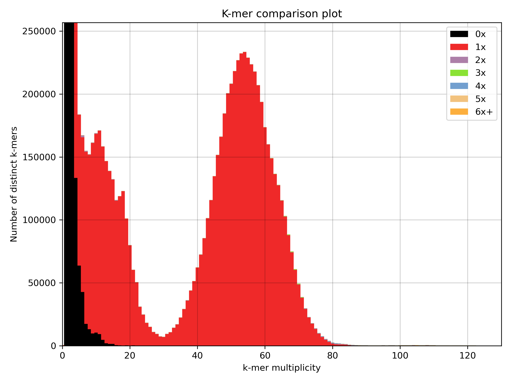

# Assembly evaluation

## BUSCO

[BUSCO](https://busco.ezlab.org/)
```sh
conda create -n busco_env
conda activate busco_env
conda install -c bioconda busco
```
```sh
busco -i assembly.fasta -o busco_assembly -m genome -c 8
```
```sh
mkdir busco_plot
cp busco*/short*bacteria_odb10*.txt busco_plot/
generate_plot.py -wd busco_plot
```


## *k*-mer analyses 

```sh
kat comp -t 8 hifi_reads.fastq.gz assembly.fasta 
```



## Checking sequence sizes

```sh
conda install -c bioconda samtools
```
```sh
samtools faidx assembly.fasta
more assembly.fasta.fai
```
```sh
contig_1	116517	10	60	61
contig_10	42507	118480	60	61
contig_11	142304	161707	60	61
contig_12	201426	306394	60	61
contig_13	52586	511189	60	61
contig_14	71378	564663	60	61
contig_15	89671	637242	60	61
contig_16	90105	728419	60	61
contig_17	70579	820037	60	61
contig_18	37158	891804	60	61
contig_19	57375	929593	60	61
contig_2	152383	987935	60	61
contig_20	34866	1142869	60	61
contig_21	90974	1178328	60	61
contig_22	154870	1270830	60	61
contig_23	56883	1428293	60	61
contig_24	86455	1486136	60	61
contig_25	57934	1574043	60	61
contig_26	141840	1632954	60	61
contig_27	5149967	1777169	60	61
contig_3	104688	7012979	60	61
contig_4	40477	7119422	60	61
contig_5	238202	7160584	60	61
contig_6	53754	7402767	60	61
contig_7	86407	7457427	60	61
contig_8	219045	7545285	60	61
contig_9	34768	7767991	60	61
```

## Select specific sequence

```sh
conda install -c bioconda seqtk
```
```sh
echo "contig_1" > name.list
seqtk subseq assembly.fasta name.list > contig_1.fasta
```

## Detecting ribosomal RNA

[BARRNAP](https://github.com/tseemann/barrnap)
```sh
conda create -n barrnap_env
conda activate barrnap_env
conda install -c bioconda barrnap
```
```sh
barrnap --threads 8 --outseq barrnap.contig_1.fasta contig_1.fasta
```

You can then use [BLAST](https://blast.ncbi.nlm.nih.gov/Blast.cgi) to try and identify these sequences. 
