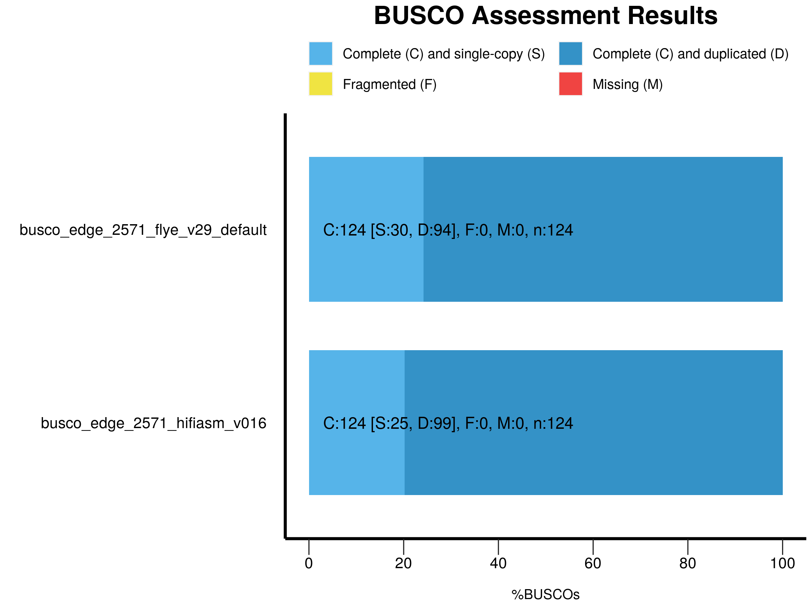

# Assembly evaluation

## *k*-mer analyses 


## BUSCO

[BUSCO](https://busco.ezlab.org/)
```sh
conda create -n busco_env
conda activate busco_env
conda install -c bioconda busco
```
```sh
busco -i assembly.fasta -o busco_assembly -m genome -c 10
```
```sh
mkdir busco_plot
cp busco*/short*bacteria_odb10*.txt busco_plot/
generate_plot.py -wd busco_plot
```


